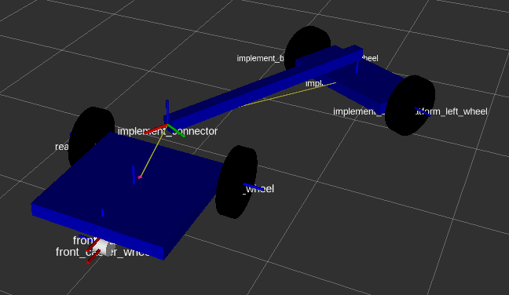

# Wheelie Bot


## Requirements
- ROS
- Rviz 
- Gazebo
- Gazebo Additional Sensor Plugins: http://wiki.ros.org/hector_gazebo_plugins, sudo apt-get install ros-DISTRIBUTION-hector-gazebo-plugins


### To Run
To Load Rviz Model:
```
roslaunch wheelie_bot display.launch
```

To Load Gazebo Simulation: 
```
roslaunch wheelie_bot gazebo.launch
```

